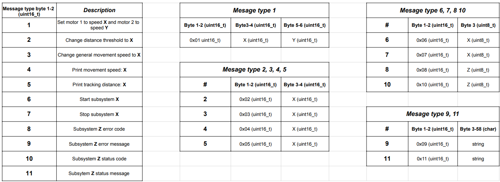

### API Overview
For the acutator subsystem I need to send a verification message on startup, robot following distance, following speed, and status. 
Any Valid messages I recieve that are intended for another teammate, I will repeat the message along the daisychain. Valid messages sent to me will include; motor speed adjust, motor rotation change (motor 1 or 2). 

#### Change Motor Speed
| Type | Byte 1 | Byte 2 |
| ---- | ------ | ------ |
| Variable Name | message_type | motor_speed |
| Variable Type | uint8_t | int8_t |
| Min Value | 0 | 0 |
| Max Value | 9 | 100 |
| Example | 0 | 50 |

#### Drive Individual motor
| Type | Byte 1 | Byte 2 | Byte 3 |
| ---- | ------ | ------ | ------ |
| Variable Name | message_type | motor_id | motor_speed |
| Variable Type | uint8_t | uint8_t | int8_t |
| Min Value | 0 | 1 | 0 |
| Max Value | 9 | 2| 100 |
| Example | 0 | 1 | 30 |

[def]: Mesage_Protocol_API.png
[MessageProtocol]: Mesage_Protocol_API.png