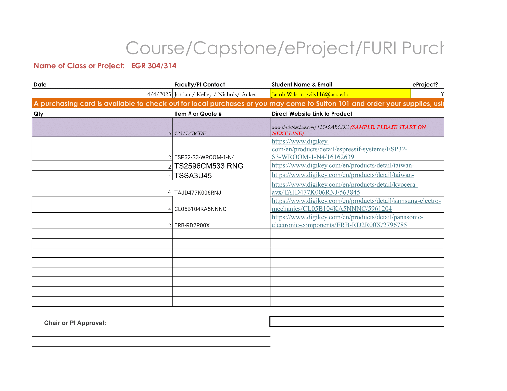
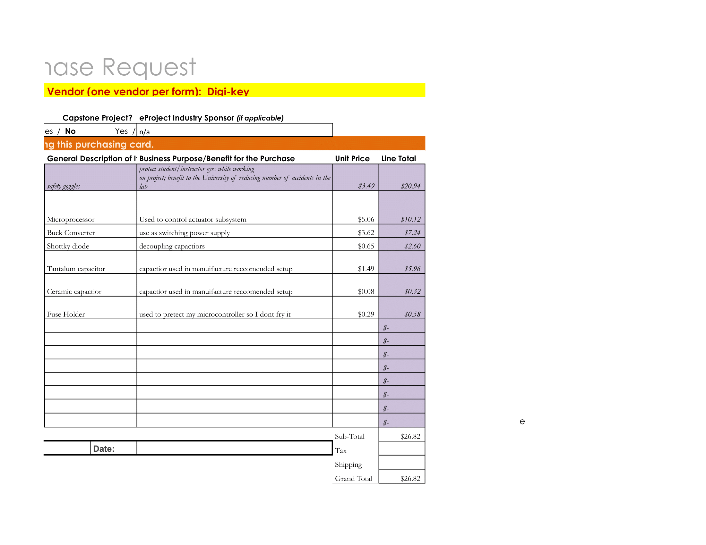
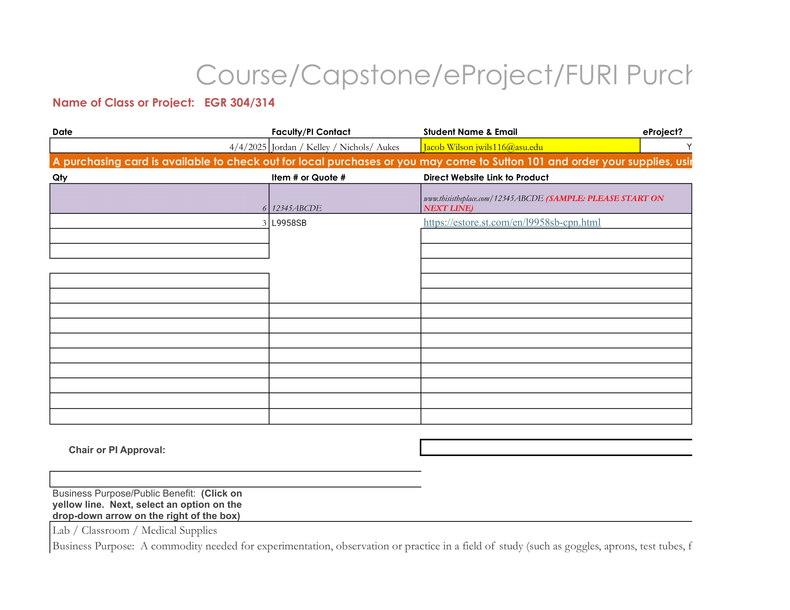
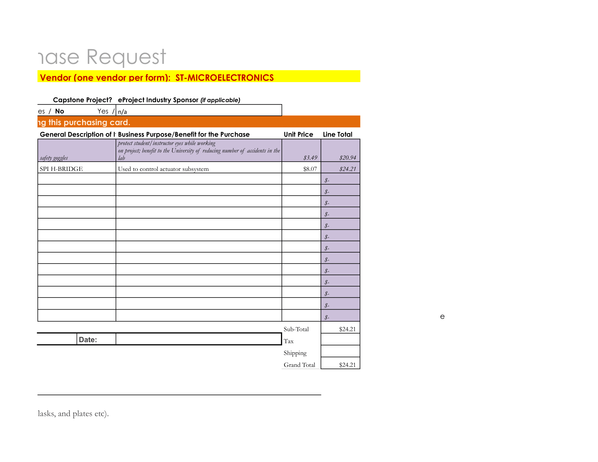

## Overview

Below is the Bill of Materials for the Actuator subsystem. Alot of these components came from our kits given out in class to pad my individual budget (the SPI H-Bridges were pricey). If a prospective student is using this as an example, please look to see what microcontrollers have already been purchased by the professors. Other than that, make sure to follow the data sheet's reccomended circuits and base your orders on those (try to order enough to make at least two copies of each circuit individually). This really helps with debugging in case of a unexpected roadblock.
### Bill of Materials/ Order Forms

