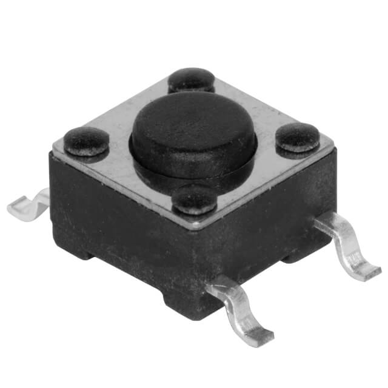

### Major Components

**Switching Voltage Regulator**

| **Solution**                                                                                                                                                                                      | **Pros**                                                                                                                                    | **Cons**                                                                                            |
| ------------------------------------------------------------------------------------------------------------------------------------------------------------------------------------------------- | ------------------------------------------------------------------------------------------------------------------------------------------- | --------------------------------------------------------------------------------------------------- |
|  Option 1  LM2575 Switching Voltage Regulator $1.75/each [link to product](https://www.digikey.com/en/products/detail/microchip-technology/LM2575-3-3WU-TR/1027646)           | \* Simple external circuit \* Small size  \* Meets surface mount constraint of project  \* Good data sheet | \* All pins are on one side \* really small                     |
|   Option 2   LT1767EMS8 Switching Voltage Regulator  $10.57/each   [Link to product](https://www.digikey.com/en/products/detail/analog-devices-inc/LT1767EMS8-3-3-TRPBF/958447) | \* Already has a circuit for 12v to 3.3v in its data sheet  \* Has a good pin layout                             | \* A lot more expensive  \* A complicated external circuit is required                  |
|   Option 3   L4971D Switching VOltage Regulator $3.70/each   [Link to product](https://www.digikey.com/en/products/detail/stmicroelectronics/L4971D/585932)                             | \* Midprice range  \* Adjustable voltage output                                                                     | \* A lot of pins  \* An external circuit with lots of components is required    |

**Choice:** Option 1: LM2575 Switching Voltage Regulator

**Rationale:** This switching voltage regulator emits an output of 3.3 volts when setup with an external circuit like shown in the detailed data sheet. The circuit is not complicated and does not require to many components externally. It also comes at a lower price than either of the other two options.It also allows a current operating range with a max of 1 A and a min voltage of 4 V with a max of 40V

**Push Buttons**

| **Solution**                                                                                                                                                                                      | **Pros**                                                                                                                                    | **Cons**                                                                                            |
| ------------------------------------------------------------------------------------------------------------------------------------------------------------------------------------------------- | ------------------------------------------------------------------------------------------------------------------------------------------- | --------------------------------------------------------------------------------------------------- |
|  Option 1  TS04-66-70-BK-160-SMT Surface Mount Push Button $0.17/each [link to product](https://www.digikey.com/en/products/detail/same-sky-formerly-cui-devices-/TS04-66-70-BK-160-SMT/15634372?gclsrc=aw.ds&&utm_adgroup=&utm_source=google&utm_medium=cpc&utm_campaign=PMax%20Shopping_Product_Low%20ROAS%20Categories&utm_term=&utm_content=&utm_id=go_cmp-20243063506_adg-_ad-__dev-c_ext-_prd-15634372_sig-CjwKCAiAzvC9BhADEiwAEhtlNzkufmbYSEAWr_kI4yTkDkaNGwd9HfJqmE0lOTE9BM8w-X6ChxQdthoC-fcQAvD_BwE&gad_source=1&gclid=CjwKCAiAzvC9BhADEiwAEhtlNzkufmbYSEAWr_kI4yTkDkaNGwd9HfJqmE0lOTE9BM8w-X6ChxQdthoC-fcQAvD_BwE&gclsrc=aw.ds)| \* Easy simple switch \* Small size \* Surface mount button | \* Not visually appealing  \* Might be to small so not as easily accessible for everyone to push |
|   Option 2   Gikfun Tact Tactile Push Button  $0.35/each   [Link to product](https://www.amazon.com/Gikfun-12x12x7-3-Tactile-Momentary-Arduino/dp/B01E38OS7K?source=ps-sl-shoppingads-lpcontext&ref_=fplfs&psc=1&smid=A34K5WF5Z9R33P&gQT=1) | \* Colorful buttons to allow for a more visual experience  \* big buttons to allow easy pushing for anyone  | \* Not specifically designed for surface mount but the leads can be bent to be surface mount  \*            |
|   Option 3   G3B15AB-XA Push Button Switch $0.81/each   [Link to product](https://www.digikey.com/en/products/detail/nkk-switches/G3B15AB-XA/1057221) | \* Bigger than the other swithces  \* Removeable cap that can be replaced with a different colored one | \* More expensive than other switches  \*   |

**Choice:** Option 2: Gikfun Tact Tactile Push Button

**Rationale:** This button is the best choice because it comes with different caps to allow easier pushing and to allow color labels on the button. The buttons also allowed for different variations of the caps that could include a label so that colorblind people can easily tell the buttons apart.

**OLED Screen**

| **Solution**                                                                                                                                                                                      | **Pros**                                                                                                                                    | **Cons**                                                                                            |
| ------------------------------------------------------------------------------------------------------------------------------------------------------------------------------------------------- | ------------------------------------------------------------------------------------------------------------------------------------------- | --------------------------------------------------------------------------------------------------- |
|   Option 1  Teyleten 0.96 inch LCD OLED Display   $2.58/each  [Link to product](https://www.amazon.com/Teyleten-Robot-Display-SSD1306-Raspberry/dp/B0CN373JF4) | \* Already provided in class  Will have experience using it | \* It is a small screen                    |

**Choice:** Option 1: Teyleten 0.96 inch LCD OLED Display Board

**Rationale:** The OLED screen is one that we have been given in class and have a lab that teaches us how to use it. Since the OLED is provided in class it will be free to use and gives more time to work with for debugging.

### Microcontroller Selection

#### Reason for Selection
For my microcontroller I decided to go with the PIC18F47Q10-I/PT. This is the surface mount varient of the PIC18F47Q10 that we have used in class. Below is a table of all the information about the microcontroller.

| PIC Info                                | Answer |
| --------------------------------------- | ------ |
| Model                                   | PIC18F47Q10-I/PT |
| Product Page URL                        | [Product Page](https://www.microchip.com/en-us/product/pic18f47q10#Overview) |
| Datasheet URL                           | [Datasheet](https://ww1.microchip.com/downloads/en/DeviceDoc/PIC18F27-47Q10-Data-Sheet-40002043E.pdf) |
| Application Notes URL                   | [Application Notes](https://www.microchip.com/en-us/product/pic18f47q10#Design%20Resources) |
| Vendor Link                             | [Vendor Link](https://www.digikey.com/en/products/detail/microchip-technology/PIC18F47Q10-I-PT/10187786) |
| Code Examples                           | [Code Example GPIO Read/Write](https://github.com/microchip-pic-avr-examples/pic18f47q10-cnano-gpio-read-write-bare/tree/1.0.6)   [Code Example I2C Read/Write](https://github.com/microchip-pic-avr-examples/pic18f47q10-cnano-i2c-read-write-temp-sensor-mcc/tree/1.0.1) |
| External Resources                      | [Programming OLED screen with MPLabX and a PIC](https://embeddedlaboratory.blogspot.com/2018/02/oled-i2c-display-using-microchip-pic.html) |
| Unit Cost                               | $1.65 |
| Supply voltage range                    | 1.8V min to 5.5V max |
| Maximum GPIO Current (per pin)          | 50 mA |
| Supports External Interrupts            | Yes |
| Required Programming Hardwar, Cost, URL | [MPLAB SNAP](https://www.microchip.com/en-us/development-tool/PG164100)   Cost: $14.99 |
| Works with MPLabX                       | Yes |
| Works with Microchip Code Configurator  | Yes |

#### Role on the team
My role on my team is to design and make the Human Machine Interface (HMI). I plan on doing this by using 3 buttons, a potentiometer, 2 LEDs and an OLED screen. The buttons will allow the user to do simple interactions like start the object following process or control a menu system that is displayed on the OLED screen. The OLED screen is going to be used to display sensor data and prompt instructions to the user on how to use it. The potentiometer will allow the user to select from a range of values to adjust the following distance or the speed of the robot itself. The LEDs will light up when a action is happening for example the green LED might turn on when the robot is in object following mode.

#### Pins needed
For my subsystem I require 12 pins not including power and ground or programming pins. I will need 5 digital input pins, 3 digital output pins, 2 pins for I2C connection, and then 2 for the UART connection. The selected microcontroller 

| Module | # Available | Needed | Associated Pins |
| ------ | ----------- | ------ | --------------- |
| GPIO   | 25          | 8      | The button GPIO pins will be on Pins RA6, RA7 and RE2   The potentiometer will be on pin RB1   The two LEDs will be on pins RD5 and RD6   The input pin from the upstream header will be on pin RD4   The output pin that goes to the downstream header will be on pin RC5 |
| ADC    | 25          | 0      | N/A             |
| UART   | 2           | 1      | Rx on pin RC7   Tx on pin RC6 |
| SPI    | 2           | 0      | N/A             |
| I2C    | 2           | 2      | SCL1 on pin RC3   SDA1 on pin RC4 |
| PWM    | 2/2         | 0      | N/A             |
| ICSP   | 3           | 3      | MCLR is on RE3   ICSPDAT is on RB7   ICSPCLK is on RB6 |

##### MCC Pin Layout
Below is the pin selection screen in MCC showing all selected pins allocated. It shows the dedicated pins for UART, the I2C pins, the MCLR pin, the open pins for ICSPDAT and ICSPCLK, then all the GPIO pins dedicated to inputs and outputs respectivly. All the pins match the table above with the pin locations. On the left side of the picture it shows the layout of all the pins on the physical microcontroller. The pins are grouped togther in a way that allows space between each section and keeping like pins together for example the Rx and the upstream input are right next to each other while the Tx and the downstream output are next to each other and the two sections are right by each other.

##### MCC Microcontroller details
Below is the setup for the microcontroller where it also shows how many different applications that it can support with its pins.

### Final Selection
The ESP32 is the best route, since it has a long track record of being used to conrol actuators in many hobbyist, and professional production applications. Since I am also planning on integrating a SPI communication link between my subsystem and the sensor subsystem, I personally think the ESP32 is the way to go. 

