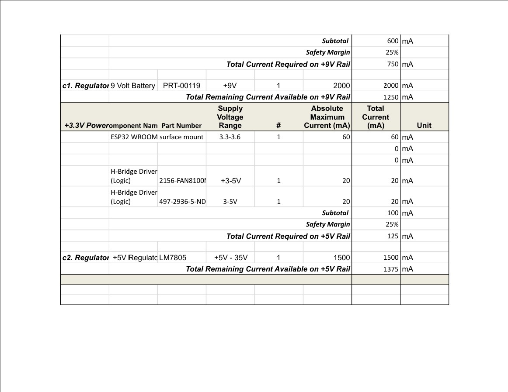
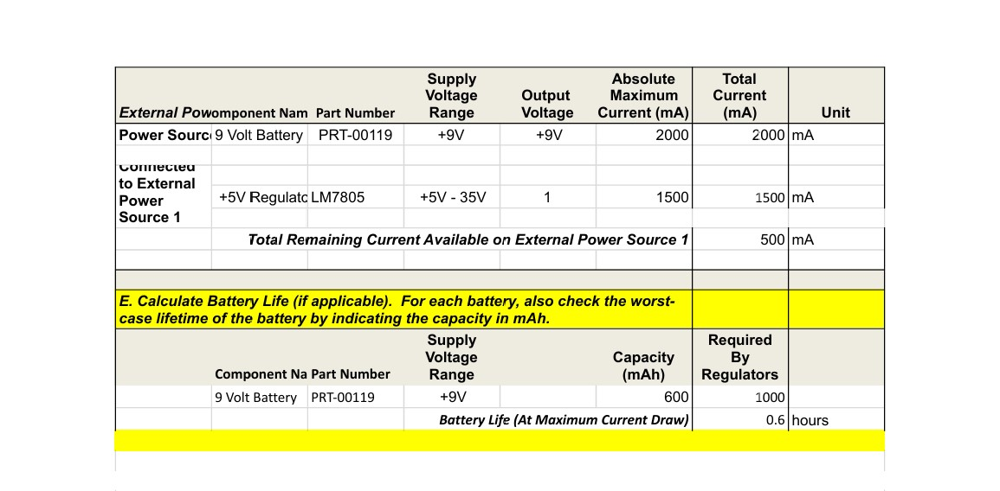

## Overview

This power budget outlines the estimated power consumption of the actuator subsystem, including the ESP32, actuators, and supporting electronics.

### Power Budget
Power Consumption Analysis
The power budget has allowed our team to determine the minimum operational runtime before requiring a battery swap under full load conditions.

Given that the actuator subsystem alone is particularly power-intensive, Team 204 is considering an approach where the other subsystems operate on separate power sources, while the actuator subsystem maintains its own dedicated power supply.

However, this decision remains tentative and will be finalized following hardware testing in the coming weeks. 

