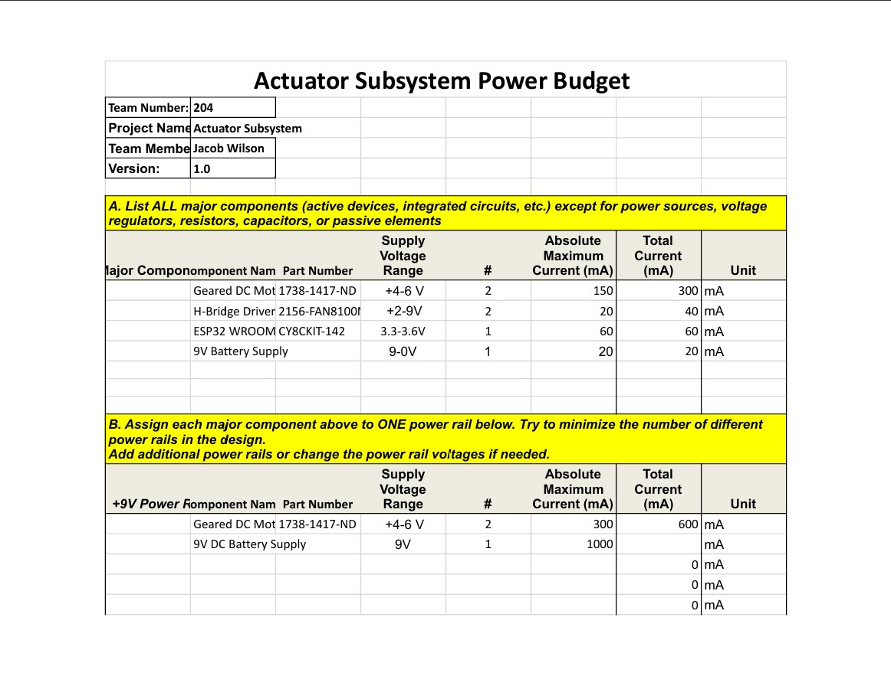
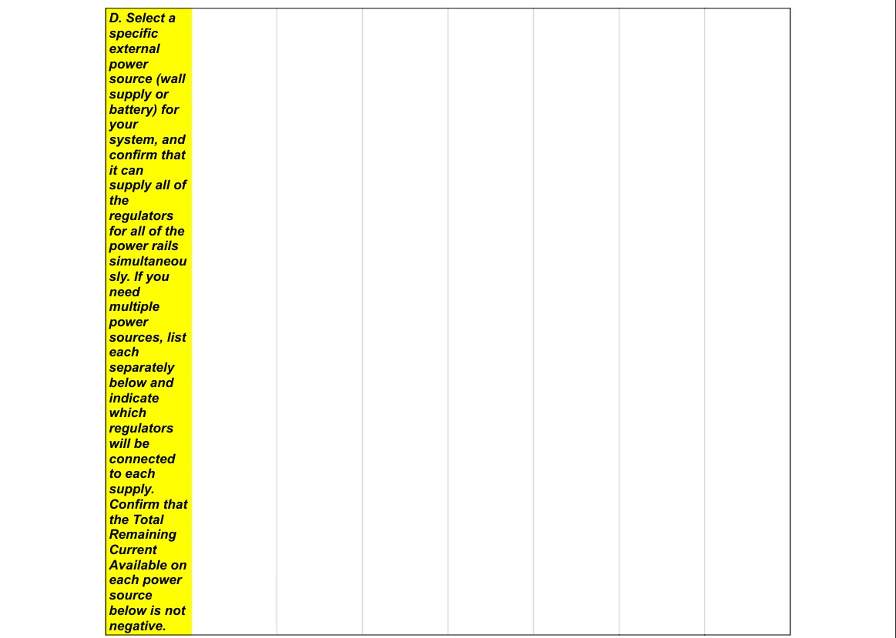

## Overview

Here is the power budget for the actuator subsystem. This includes the actuators and the esp32 and supporting electronics only in the actuator subsystem. 

### Power Budget
The Power Budget has helped our team find the minimum amount of run time we have before we need to switch batteries under full load. Since we have come to the conclusion that the actruator subsystem alone love is very power hungry, team 204 might opt to have the other subsystems run on separate power, while the actuator subsytem has its own power source. However, this is TBD in the coming weeks when our hardware arrives for testing. 

