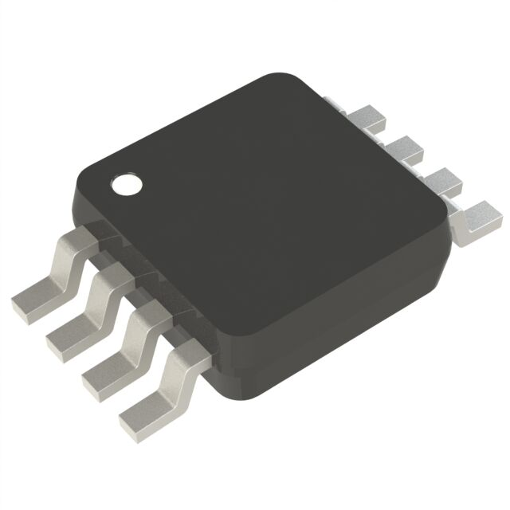
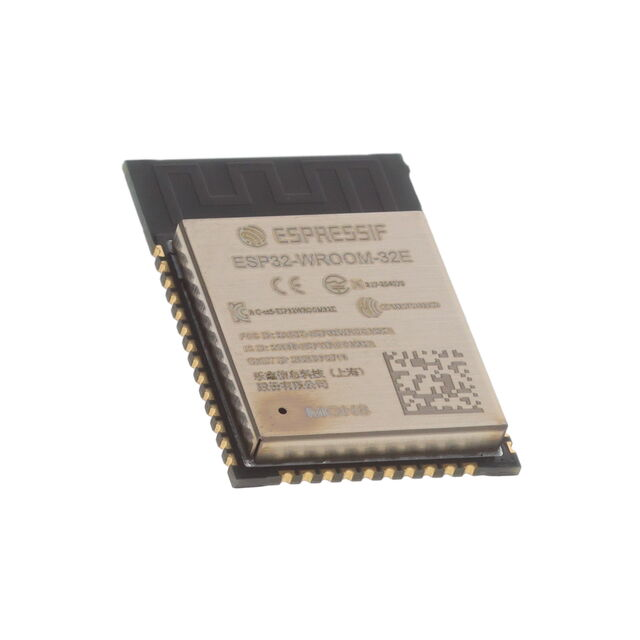

### Major Components

**Switching Voltage Regulator**
The voltage regulator is a critical component for ensuring stable power delivery to the ESP32 surface mount and supporting components on the PCB. Below are the evaluated options:
| **Solution**                                                                                                                                                                                     | **Pros** | **Cons** |
|          |          |  |
|  Option 1  LM2575 Switching Voltage Regulator $1.75/each [link to product](https://www.digikey.com/en/products/detail/microchip-technology/LM2575-3-3WU-TR/1027646)           | \* Simple external circuit \* Small size  \* Meets surface mount constraint of project  \* Good data sheet | \* All pins are on one side \* really small                     |
|   Option 2   LT1767EMS8 Switching Voltage Regulator  $10.57/each   [Link to product](https://www.digikey.com/en/products/detail/analog-devices-inc/LT1767EMS8-3-3-TRPBF/958447) | \* Already has a circuit for 12v to 3.3v in its data sheet  \* Has a good pin layout                             | \* A lot more expensive  \* A complicated external circuit is required                  |
|   Option 3   L4971D Switching VOltage Regulator $3.70/each   [Link to product](https://www.digikey.com/en/products/detail/stmicroelectronics/L4971D/585932)                             | \* Midprice range  \* Adjustable voltage output                                                                     | \* A lot of pins  \* An external circuit with lots of components is required    |

**Choice:** Option 1: LM2575 Switching Voltage Regulator

**Rationale:** Following Jake’s approach, I have chosen the LM2575 regulator as it offers a simple circuit, compact size, and ease of integration while meeting surface mount constraints. This regulator will provide stable power for the ESP32 and additional PCB components.

### Microcontroller Selection

I have selected a variant of the ESP32 WROOM surface mount microcontroller. The total number of required pins is still to be determined, but the ESP32 provides sufficient versatility for actuator control and SPI communication.

#### Role on the team
The actuator subsystem processes incoming data from the sensor subsystem and dynamically adjusts actuator states—whether turning components on/off or modifying their speed. This subsystem is critical for maintaining the sensor's tracking accuracy.

#### Pins needed

For my subsystem I require 27 pins not including power and ground or programming pins. I used 21 digital IO pins, 2 pins for Micro USB connection, and then 4 for the SPI interface. 

| Module | # Available | Needed | Associated Pins |
| ------ | ----------- | ------ | --------------- |
| GPIO   | 32          | 21     | Please Refer to Schematic |
| ADC    | 25          | 0      | N/A |
| UART   | 2           | 2      | RX and TX |
| SPI    | 4           | 4      | I0 13-16 |
| I2C    | 0           | 0      | N/A |
| PWM    | 32          | 2      |  IO 38 and 47 |
| ICSP   | 2           | 2      | D+ and D- |

### Final Selection
The ESP32 has a strong track record in actuator control applications, ranging from hobbyist projects to professional-grade systems. Additionally, since I plan to integrate an SPI communication link between the actuator and sensor subsystems, the ESP32 provides the necessary features and flexibility.

