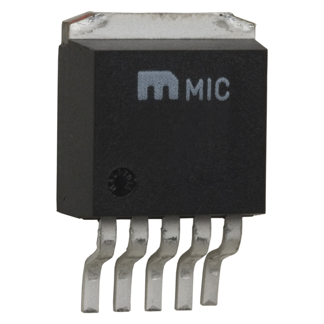

### Major Components

**Switching Voltage Regulator**

| **Solution**                                                                                                                                                                                      | **Pros**                                                                                                                                    | **Cons**                                                                                            |
| ------------------------------------------------------------------------------------------------------------------------------------------------------------------------------------------------- | ------------------------------------------------------------------------------------------------------------------------------------------- | --------------------------------------------------------------------------------------------------- |
|  Option 1  LM2575 Switching Voltage Regulator $1.75/each [link to product](https://www.digikey.com/en/products/detail/microchip-technology/LM2575-3-3WU-TR/1027646)           | \* Simple external circuit \* Small size  \* Meets surface mount constraint of project  \* Good data sheet | \* All pins are on one side \* really small                     |
|   Option 2   LT1767EMS8 Switching Voltage Regulator  $10.57/each   [Link to product](https://www.digikey.com/en/products/detail/analog-devices-inc/LT1767EMS8-3-3-TRPBF/958447) | \* Already has a circuit for 12v to 3.3v in its data sheet  \* Has a good pin layout                             | \* A lot more expensive  \* A complicated external circuit is required                  |
|   Option 3   L4971D Switching VOltage Regulator $3.70/each   [Link to product](https://www.digikey.com/en/products/detail/stmicroelectronics/L4971D/585932)                             | \* Midprice range  \* Adjustable voltage output                                                                     | \* A lot of pins  \* An external circuit with lots of components is required    |

**Choice:** Option 1: LM2575 Switching Voltage Regulator

**Rationale:** I am following the footsteps of Jake, and also choosing this switching voltage regulator. This will help power the ESP32 surface mount and any other suporting components that will make their way onto the pcb later this semester. 

### Microcontroller Selection

I am choosing a varaint of the ESP32 WROOM surface mount. The total number of pins I need are still TBD.

#### Role on the team
The actuator subsystem is in charge of receiving data from the sensor subsystem, processing it, then adjusting the current state of the actuators. Whether that is on or off, or slow or fast, my subsystem is aimed at keeping the sensor subsystem on target. 

#### Pins needed
For my subsystem I am not completely sure how many pins I will use in total, however so far I need 7 so far. 3 for serial data and clock, and 4 for controlling the actuators. 

| Module | # Available | Needed | Associated Pins |
| ------ | ----------- | ------ | --------------- |
| GPIO   | 25          | 4      |                 |
| UART   | 2           | 2      |   35,34         |
| SPI    | 2           | 2      | TBD             |
| I2C    | N/A         | N/A    | N/A             |
| PWM    |  N/A        | TBD    | TBD             |

### Final Selection
The ESP32 is the best route, since it has a long track record of being used to conrol actuators in many hobbyist, and professional production applications. Since I am also planning on integrating a SPI communication link between my subsystem and the sensor subsystem, I personally think the ESP32 is the way to go. 

