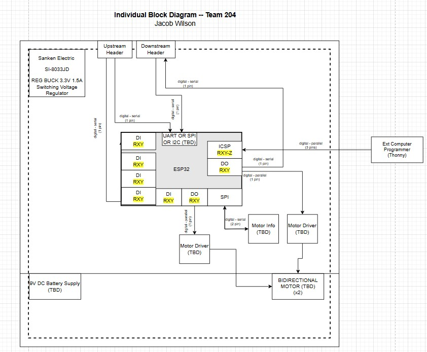

## Block Diagram

### Overview
Here is the Block Diagram for the actuator subsystem. The microcontroller chosen to run the actuator subsytem is the ESP32 WROOM surface mount. With that, I plan on using SPI to communicate with the sensor module, and to use uart with the others. The actuator itself will be powered by a separate 9V DC battery supply, while the other electronics will use shared power from a 3.3V buck converter setup. The upstream and downstream headers are to allow serial communication between all subsystems through a daisychain connection. 

### Block Diagram

