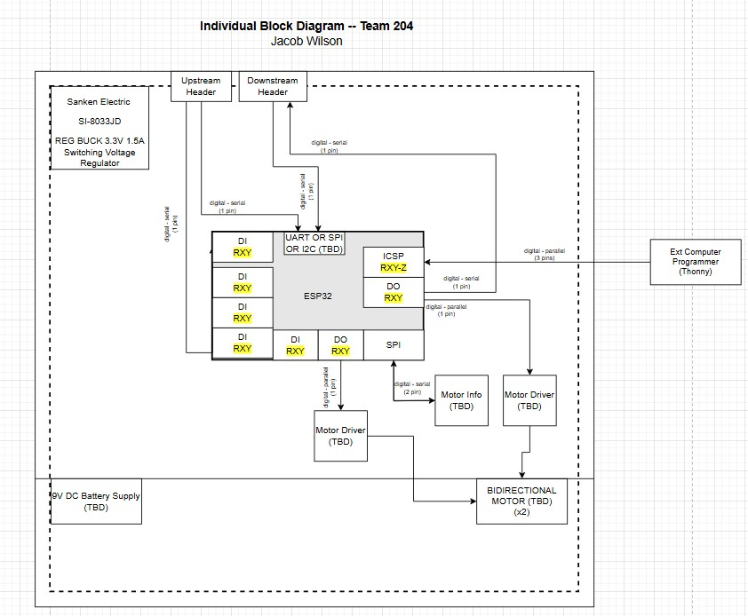
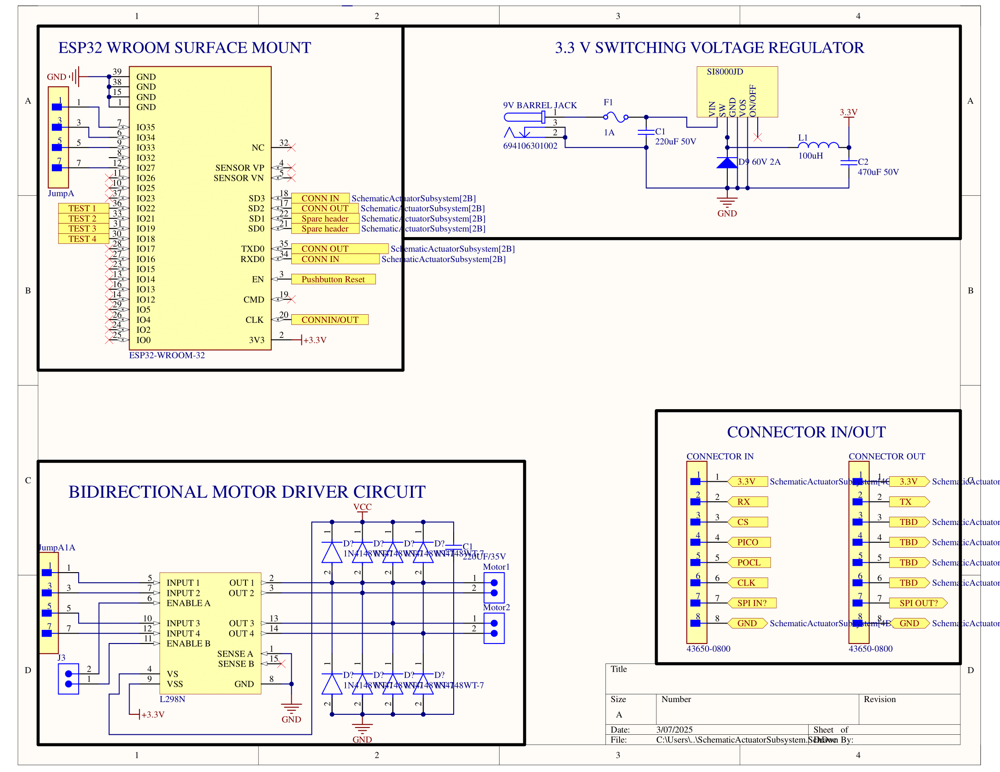

## Block Diagram

### Overview
Here is the Block Diagram and schematic for the actuator subsystem. The microcontroller chosen to run the actuator subsytem is the ESP32 WROOM surface mount. With that, I plan on using SPI to communicate with the sensor module, and to use uart with the others. The actuator itself will be powered by a separate 9V DC battery supply, while the other electronics will use shared power from a 3.3V buck converter setup. The upstream and downstream headers are to allow serial communication between all subsystems through a daisychain connection. 

### Block Diagram and Schematic

The functionality of the schematic satisies our product requirements by allowing our motors to be controlled through SPI communication with my teammates boards. In terms of user needs, this setup puts reliability and reproducablilty at the forefront. There is nothing fancy happening here, just raw performance. 
[Altium Zip File](ActuatorSubsystemSchematic.zip)