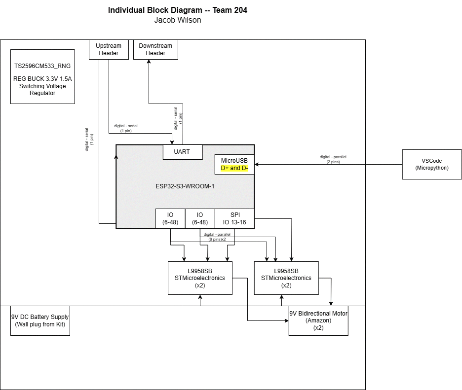

## Block Diagram

### Overview
This section presents the Block Diagram and schematic for the actuator subsystem, detailing communication protocols, power distribution, and system integration.

Microcontroller & Communication Protocols
The ESP32 WROOM surface-mount microcontroller is selected to control the actuator subsystem.

SPI is utilized for communication with the sensor module and actuators.

UART is employed for interfacing with the remaining subsystems.

Power Distribution
Actuator Power Supply: A dedicated 9V DC battery ensures stable operation.

Supporting Electronics Power: A 3.3V buck converter setup supplies shared power for additional components.

Serial Communication Integration
To maintain seamless data flow across all subsystems, upstream and downstream headers enable serial communication through a daisy-chain connection, ensuring efficient message propagation. 

### Block Diagram and Schematic

The functionality of the schematic satisies our product requirements by allowing our motors to be controlled through SPI communication with my teammates boards. In terms of user needs, this setup puts reliability and reproducablilty at the forefront. There is nothing fancy happening here, just raw performance. 
[Schematic Zip File](Individual_Block_Diagram_and_Schematic/PCB314 - Copy.zip)