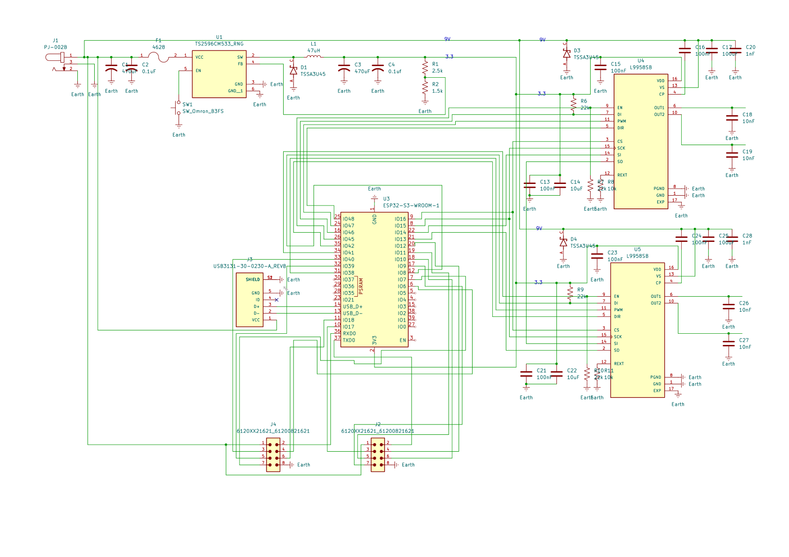
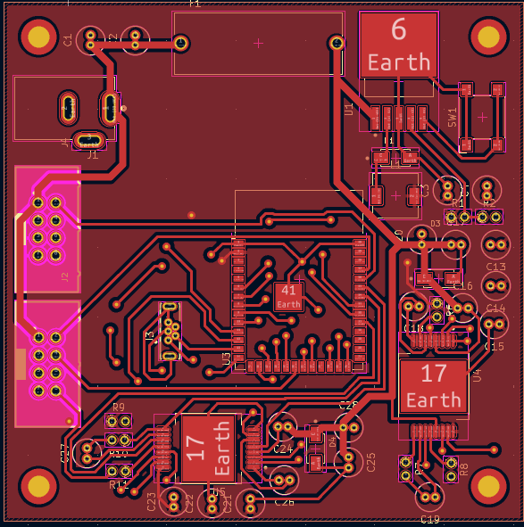
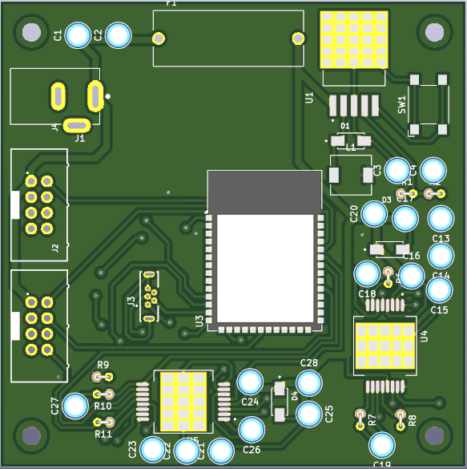
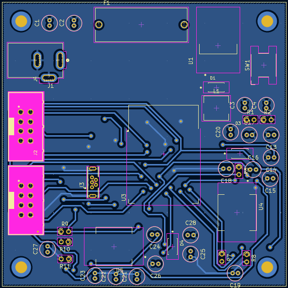
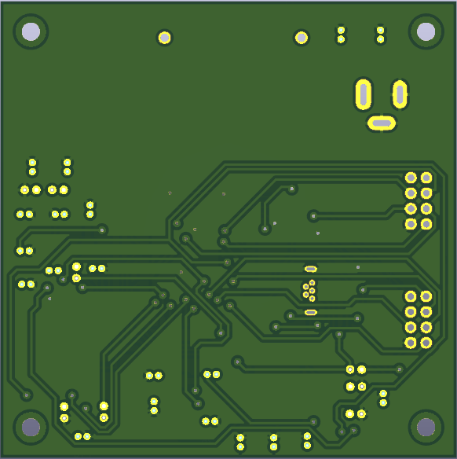

### Schematic Design

## PCB Design
Below is the PCB for the actuator subsystem. The PCB is based off of the schematic above and fits on a 75x75mm board. In each corner is a hole 5mm from the sides that is on all of our team's subsystem boards allowing them all to stack vertically saving space, as well as looking aesthetically pleasing. 
### PCB 
#### Top of PCB
##### Circuit Layout

##### 3D Model

#### Bottom of PCB
##### Circuit Layout

##### 3D Model

## Manufactured PCB
### Overview 
The PCB was manufactured by Peralta Lab using the design shown above. Below both the unpopulated PCB and the populated PCB are shown. The populated PCB is has all the parts from the bill of materials and from our kits. 
### Manufactured Unpopulated PCB
#### Top of  PCB

#### Bottom of PCB

### Issues With The Design
Some Issuses that were encountered with the PCB design that was not discovered till after manufacturing was the two eight pin connectors. The footprint used was to small for the actual part so some modifications to the board were made using deadbugging. Another issue that went unnoticed was the CLK line for I2C was connected to the microcontroller via a pin that would not allow I2C so using an extra GPIO pin a modifcation was made and the CLK line was moved.

### Populated PCB
##### Top of PCB

#### Issues After Populating
After fixing the issues found right after manufacturing some more issues we apparent. One major issue were the vias. Each via had to be hand soldered, since no pro conduct was introduced to the board. After funbling for a bit, I chose to use resistors to connect the top plane of the board (3.3V) to the bottom (GND). I would then snip off the resistor part and just keep the tiny wires. Unaesthetically pleasing, but effective. Another problem that arose, was that I used the wrong footprint for my 470uF capactitors. I used a THT footprint, vs a surface muount one. To solve this issue, I again soldered on resistor wires to the ends of the SMD capactors and made custom THT capacitors. 

## Team Decision with PCBs
In our team as mentioned above in the PCB overview our team opted to go for a standard size of 75x75mm with 3mm holes 5mm away from each corner to allow for our PCBs to be stacked veetically. We thought that this would be a good design choice to allow for compact packaging which is key to making our project sucessful as it needs to be able to freely move around. We also shared a lot of design tips and checked each others board to make sure that the connections were good overall. While somethings did get missed on first look they did not impact the overall project in the end. By verifying that we all had met the class standards we were able to make sure that we could all connect without risk of damaging someone else's PCB.

## Improvements to be Made
The major improvements to be made would be to redesign the PCB. I would live to accomodate more surface mount supporting electronics (resistors, etc.) If I were to tackle this again, I would try extra hard to produce a almost mass producable board. I would also seek professional help though digikey and other contacts I know who do pcb engineering and manufacturing as their profession. If I also had just more time, I feel the product I could've produced would outshine my current model by at least 2X. 

## Downloadable files
Below are the files related to the design, production, and check off of the Schematic and PCB

### Design Files
The Files for the PCB and Schematic can be downloaded from this: [Actuator System PCB and Schematic zip folder](PCB314 - Copy.zip)

### Gerber and Drill Files
The Gerber and Drill files for manufacturing can be downloaded from this: [Actuator System Gerber and Drill files zip folder](GERBER AND DRILL 314.zip)

### Hardware Checkoff Code
The Python code that was used during the in class hardware check off for EGR 314 can be downloaded from this: [Python code zip folder](ESPCODE314_JW.zip)

